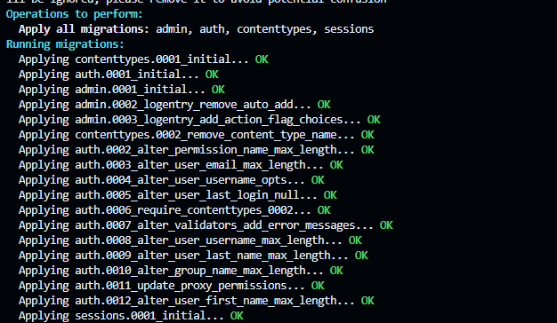
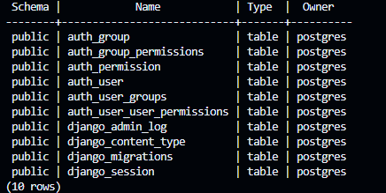
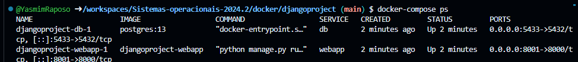
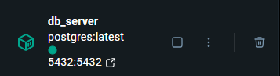

# Docker compose com Django e banco de dados

## Informações gerais

- Assunto: Docker, conteinizar aplicativos
- Disciplina: *sistemas operacionais*
- **Tarefa**:
  1. Criar um projeto django com uma aplicação web
    - alternativa, criar uma _branch_ no repositório do projeto integrador para configurar o acesso ao repositório de dados
  2. Criar um `Dockerfile` para o projeto django
  3. Criar a imagem e testar o conteiner para testar
  4. OPCIONAL, porque dependendo de como pergunta ao assistente de IA; criar um `Dockerfile` para o repositório de banco de dados
  5. Criar um `docker-compose.yml` e configurar para 2 serviços: `webapp` e `db`
  6. Configurar o arquivo django de acesso ao repositório de dados para usar o serviço docker `db`
  7. Testar o `docker-compose.yml`
  8. Relatar minimamente o que foi feito.
- **Entrega**: copia desse aquivo markdown preenchido, no seu repositório _fork_ de https://github.com/sistemas-operacionais/2024.2


## Relatório

### Aluno

- nome: [Yasmim Fernandes de Oliveira Raposo](https://github.com/YasmimRaposo/Sistemas-operacionais-2024.2)
- matrícula: 20231014040007

### Relato

### Arquivos Docker e de Configuração do Django

1. **djangoproject**: O projeto Django foi iniciado e nomeado como "djangoproject", com a aplicação "webapp". Algumas alterações foram feitas no arquivo `settings.py` para configurar o acesso ao banco de dados.

2. **Dockerfile**:
   - A imagem base é a oficial do Python.
   - Instala as dependências do `requirements.txt` e configura o Django para rodar na porta 8000.

   ```Dockerfile
FROM python:3.9
WORKDIR /app
COPY requirements.txt /app/
RUN pip install --no-cache-dir -r requirements.txt
COPY . /app/
CMD ["python", "manage.py", "runserver", "0.0.0.0:8000"]
   ```

3. **docker-compose.yml**: O `docker-compose.yml` define os serviços necessários para a aplicação:

   ```yaml
   services:
     # Serviço db (PostgreSQL)
     db:
       image: postgres:13  # Usa a imagem oficial do PostgreSQL versão 13
       environment:
         POSTGRES_USER: postgres  # Cria um usuário 'postgres'
         POSTGRES_PASSWORD: postgres  # Define a senha do usuário 'postgres'
         POSTGRES_DB: services  # Define o nome do banco de dados como 'services'
       ports:
         - "5433:5432"  # Mapeia a porta 5432 interna do PostgreSQL para 5433 no host

     # Serviço webapp (Django)
     webapp:
       build: .  # Cria a imagem a partir do Dockerfile local
       command: python manage.py runserver 0.0.0.0:8000  # Executa o servidor Django
       volumes:
         - .:/app  # Mapeia o diretório local para o diretório /app no contêiner
       ports:
         - "8001:8000"  # Mapeia a porta 8000 interna do Django para 8001 no host
       depends_on:
         - db  # Garante que o serviço 'db' (PostgreSQL) seja iniciado antes do 'webapp'
webapp'


### Problemas Enfrentados
- **Erro "port already allocated"**: Esse erro ocorreu porque a porta 8000 já estava sendo utilizada por outro serviço. Foi resolvido após parar o serviço que estava utilizando essa porta.
- **Erro "ModuleNotFoundError: No module named 'dotenv'"**: O erro foi causado pela falta da dependência `python-dotenv` no projeto. Foi resolvido com a instalação da dependência usando o comando `pip install python-dotenv`.

### Testes Realizados
- **Execução dos Serviços**: A execução dos serviços foi realizada com sucesso utilizando o comando `docker-compose up`.
- **Migrações**: As migrações do Django foram aplicadas com `docker-compose exec webapp python manage.py migrate`.
- **Acesso à Aplicação**: A aplicação Django foi acessada no navegador por meio do docker run -p 8000:8000 django-app






- djangoproject-db-1: Este é o contêiner que está rodando o PostgreSQL. Ele está escutando na porta 5432 dentro do contêiner, e a porta 5433 foi mapeada para o seu localhost. Ou seja, você pode acessar o banco de dados PostgreSQL em localhost:5433.

- djangoproject-webapp-1: Este é o contêiner do Django. Ele está rodando na porta 8000 dentro do contêiner, e a porta 8001 foi mapeada para o seu localhost. Ou seja, você pode acessar a aplicação Django em localhost:8001.




### Conclusão
A configuração do ambiente foi concluída com êxito, utilizando Docker para isolar o Django e o PostgreSQL em contêineres distintos. O contêiner djangoproject-db-1 está rodando o PostgreSQL na porta 5433, enquanto o contêiner djangoproject-webapp-1 executa o Django na porta 8001. Ambos os serviços estão isolados, permitindo uma comunicação interna segura e eficiente. A integração entre os serviços foi bem-sucedida, proporcionando um ambiente de desenvolvimento limpo e sem conflitos. Além disso, a aplicação Django se conecta ao banco de dados PostgreSQL corretamente.

